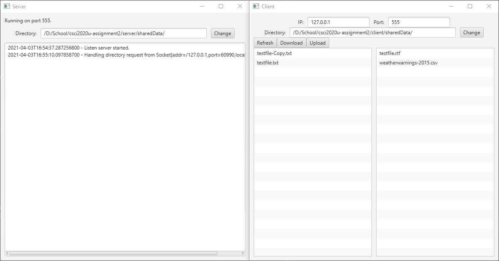

# CSCI2020u-assignemnt2 #
April 3rd, 2021
Alexander Naylor 100696151

## Project Information ##
The task of this assingment was to create a fileserver and client, the client had to be able to view the designated directories on the client and server side, and the system had to facilitate transfer of text base doccuments in both directions.

## Improvments ##
The primary improvement I implemented is the ability to change which directory is the dedicated shared directory on both the server and client side, all paths are also done reletive to the shared directory so that directory structure is hidden from the client.

I've also included some testdata in the server and client project folders, labled 'sharedData' and 'sharedData2'

## Limitations ##
Due the a quirk with java's URI system that I could not work around, this system cannot work with paths that have spaces. The system also can only with with text based file formats, and the system cannot display display subdirectories or their contents.

## How to run ##
1. Clone the project using git to a directory of your choice.
2. In the root folder, use the gradle wrapper to build and run the system `./gradlew run` (Thanks to gradle's subprojects system, both client and server will build automaticaly.)
3. The default parameters should allow for instant useage, if not, ip and port of the server and client may need to be configured.
4. Using the REFRESH button, you can view files on both the client and server side.
5. By selecting a file on either the client or server lists, you can then press the upload or download button to transfer the file as you desire.